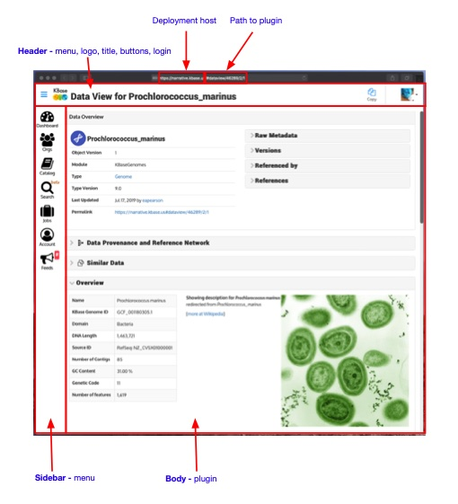
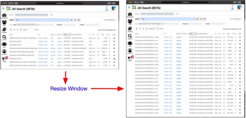
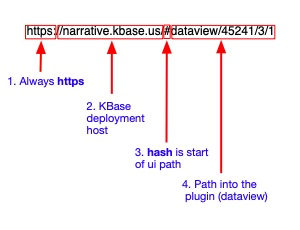
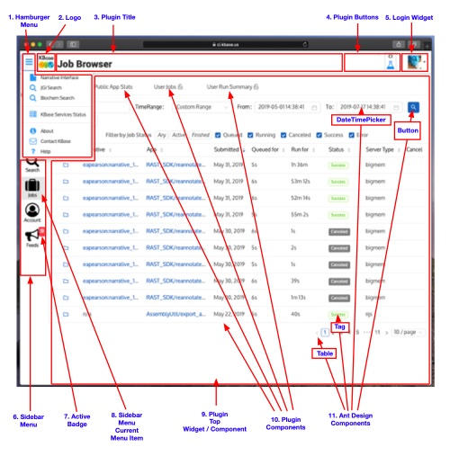

---
---

# KBase UI Layout

## General

At the top level, *kbase-ui* has a relatively simple layout:

Below is a representative screenshot of a Genome Landing Page. The top level layout components are highlighted.

{:class="screenshot"}

The top level layout of the ui consists of a header, sidebar, and body.

The **header** is a fixed height and stretches across the window. The **sidebar** is located on the left side of the window and is a fixed width stretching down to the bottom of the window. The **body** uses all of the remaining space, stretching to the right and to the bottom of the window.

Note that the body uses a full-height *flexbox*. This allows the plugin inside to use a variety of approaches to using the available space in the body. 

For instance, in the example above the landing page sets up a container with y-direction automatic overflow, which will create a scrollbar when the content stretches below the bottom fo the screen. 

{:class="screenshot"}

Also of note is the appearance of the url bar in the browser. While not technically part of the kbase-ui layout, it is important to understand the structure

`https://narrative.kbase.us/#dataview/45241/3/1`

{:class="screenshot"}

1. The url **protocol** is always `https:`

2. The **hostname** corresponds to a KBase deployment environment:

   - **narrative.kbase.us**: production
   - **ci.kbase.us**: CI development host
   - **appdev.kbase.us**: SDK App development host
   - **next.kbase.us**: pre-production testing
   - **narrative-dev.kbase.us**: experimental kbase-ui and narrative builds using CI services
   - **narrative-refactor.kbase.us**: dedicated to the ongoing refactoring work for kbase-ui and narrative using production services
  
3. The url **hash** `#`, separates the main url from the *fragment*. The `#` may be preceded or followed by a `/`, but is not necessary.

4. Finally the string to the right of `#` is the url fragment, which is the path to the plugin. This string is matched to the set of route paths defined by all of the ui plugins, and the first match will be used. In this case the route path defines a static component `dataview`, and three parameters `workspaceId`, `objectId`, and `objectVersion`.

## More Detail

Let's drill down a bit more into the next level of detail in the ui layout.

{:class="screenshot"}

The **header area** consists of a
    - (1) **hamburger menu** which drops down a set of auxiliary menu items supplied by plugins
    - (2) **kbase logo** which is also a link. to *kbase.us*
    - (3) **title** which is set by a plugin
    - (4) **buttons** which are set by plugins
    - (5) **login widget** which is provided by an internal kbase-ui plugin

The (6) **sidebar menu**, partially obscured in this example, is also derived from plugins. That is, plugins provide the menu items, including the label, icon, and path.

Two features are pointed out in this example. If the current plugin matches a sidebar menu item, that item is (8)  **highlighted**.

Second, a sidebar menu item may display a (7) **badge** with a count. In this case it is for the Feeds service. The badge updates every 10 seconds by default. At present this badge is idiosyncratic - it is implemented as custom code in the sidebar menu widget - it isn't integrated at the plugin level.

Finally we have an example of another plugin displayed in the **body area**. It is difficult to convey, due to the flat nature of the ui compared to the hierarchical nature of components. The plugin consists of layers of components, starting at the very top of the plugin.

Plugin components are comprised of (10) **KBase created components** and components from the (11) **Ant Design component library**.

For example, the complete set of tabs is wrapped in a plugin component, the tab itself is an Ant Design component. Each tab and tab area is a component created in the plugin. Inside the displayed tab are an array of Ant Design components - e.g. **DateTimePicker**, **Button**, **Tag**, and **Table**.

---

So that is a review of the kbase-ui layout.

Next lets consider the code architecture:

[Architecture](./architecture){:class .btn}

