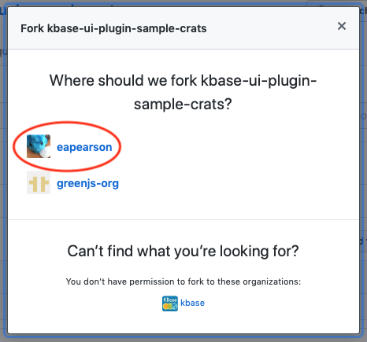

# Step 2: Create Repos

Each plugin lives it its own repo, the canonical upstream source for which is in the _KBase_ organization at github.

## Instructions

### 1. Create plugin repo at KBase Incubator github organization

KBase operates a github organization at _https://github.com/kbaseIncubator_. All KBase developers should have privileges to create new repositories in _kbaseIncubator_ (although once created you won't have admin access to the repo, and will need to request repo configuration if you need it, which we will.)

In general, new repositories should be created at _kbaseIncubator_ in their early development before being migrated to the _kbase_ organization.

1. Take your favorite browser to https://github.com/kbaseIncubator

2. <div class="top-align-flex" markdown="1">
   Click the New Repo button: 
   </div>

3. This brings up the new repository form. Fill it out thusly:

   - Give the repo a name according to the pattern `kbase-ui-plugin-{PLUGIN_NAME}`, where `kbase-ui-plugin-` is the prefix given to all kbase-ui plugins, and `{PLUGIN_NAME}` is the name you want to give your plugin.
     - The plugin name should contain only lower case letters.
     - The dash `-` should be used to separate the words of a compound word (rather than running them together, or using camel case).
     - A digit (0-9) may be used as well, sparingly, e.g. to distinguish a major new version of a plugin.
     - Try to use full words, not initials or other contracted forms.
     - See [existing plugin repos](https://github.com/kbase?utf8=✓&q=kbase-ui-plugin-) for examples
   - Check the option **Initialize this repository with a README**. This will enable you to immediately fork the repo, rather than have to push up initial content first.

4. Click the Create repository button 

5. After the repo has been created, the browser should redirect to the repo page.

### 2. Fork this plugin repo to your account

Since KBase requires Pull Requests as part of the code control workflow, you will need to fork the repo to your own github account.

- Click the Fork button 
- Choose your account from the dialog:
  
- After a few seconds, the kbaseIncubator repo should have been forked to your account; the browser should redirect there automatically.

### 3. Clone this repo locally

Now we are ready to fork the repo to your local machine. With the Pull Request workflow, you always work from a clone of your own fork of the upstream repo at kbaseIncubator, kbase, or kbaseapps.

- Open a new Terminal window or tab
- Navigate to the _project_ directory which contains the kbase-ui you have already cloned.
- At the terminal prompt, enter:

  ```bash
  git clone https://github.com/{YOUR_ACCOUNT}/{REPO_NAME}
  ```

  or if you use ssh keys for github auth:

  ```bash
  git clone ssh://git@github.com/{YOUR_ACCOUNT}/{REPO_NAME}
  ```

## Next Steps

[Step 3. Dev Tools](./3-dev-tools)

\---
